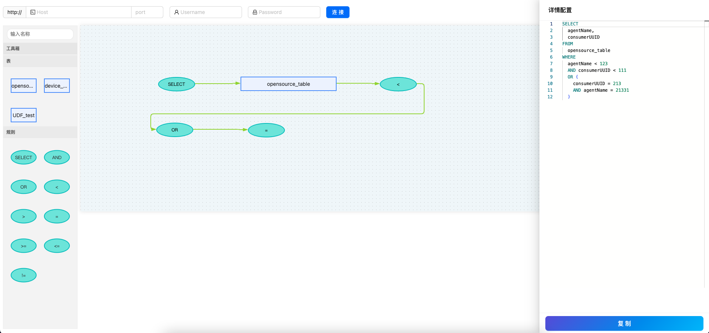

# graphical-sql-parser
低代码开发，JSON 格式通过图像拖拉拽生成 SQL 语法。只是半成品Demo，只支持查询语句生成（支持查询字段函数作用），简陋的多表语句生成（选字段不生效）。因为是Demo所以没太关注代码规范，注释比较少。

SQL 语法解析核心库：https://g14n.info/SQL92-JSON/#api

基于原库定制化 stringify：https://github.com/zhengjialux/SQL92-JSON （解析JSON支持自定义函数）

图形库：https://x6.antv.antgroup.com/tutorial/about

查询语句

多表查询、自定义函数

